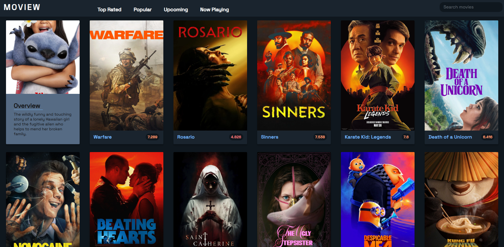
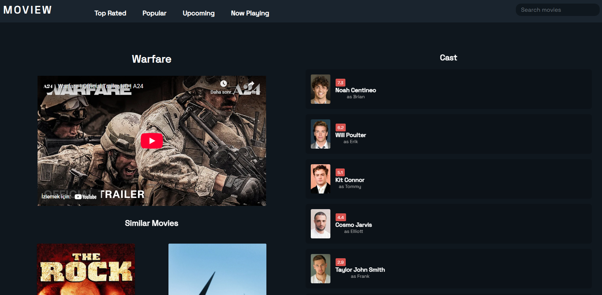

# :tv: Movie App

This project is a web application that allows you to discover popular movies and TV shows. With its user-friendly interface, you can easily find and view details of your favorite content.

## ✨ Features

- List popular movies and TV shows
- Search for movies and TV shows
- View details of movies and TV shows (summary, cast, rating, etc.)
- Recommend similar movies and TV shows

## 🚀 Technologies Used

- **Framework:** [Next.js](https://nextjs.org/)
- **Language:** [TypeScript](https://www.typescriptlang.org/) (or JavaScript)
- **Styling:** [Tailwind CSS](https://tailwindcss.com/)
- **API:** [The Movie Database (TMDB) API](https://www.themoviedb.org/documentation/api) (or another API you are using)
- **State Management:** (Specify if you are using one, e.g., Zustand, Redux Toolkit)
- **Deployment:** [Netlify](https://netlify.com/) (or another platform you are using)

## 🛠️ Setup

Follow these steps to run the project locally:

1.  **Clone the repository:**
    ```bash
    git clone https://github.com/yourusername/movie-app.git
    cd movie-app
    ```
2.  **Install dependencies:**
    ```bash
    npm install
    # or
    yarn install
    # or
    pnpm install
    # or
    bun install
    ```
3.  **Set up environment variables:**
    Create a file named `.env.local` (or copy `.env.local.example` if it exists) and rename it to `.env.local`. Then, add your necessary API keys and other environment variables to this file. For example:
    ```
    NEXT_PUBLIC_API_KEY=your_tmdb_api_key_here
    NEXT_PUBLIC_TMDB_IMAGE_BASE_URL=https://image.tmdb.org/t/p/
    ```
4.  **Start the development server:**
    ```bash
    npm run dev
    # or
    yarn dev
    # or
    pnpm dev
    # or
    bun dev
    ```
    The application will run by default at [http://localhost:3000](http://localhost:3000).

## Screenshots




---

You can further enhance this README file according to the specific needs of your project. For example, you can add more details about your API endpoints, a section about the project's architecture, or known issues and solutions.
